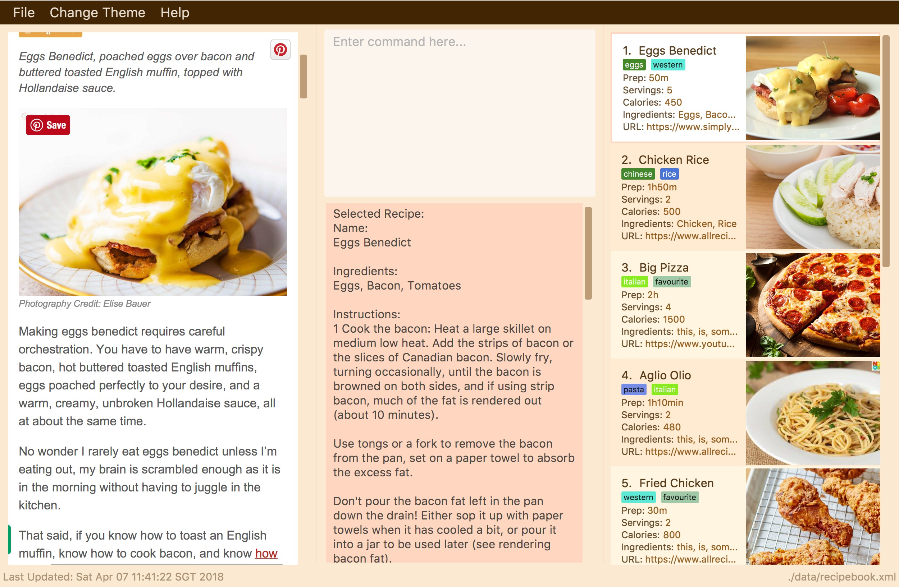

= ReciRecipé
ifdef::env-github,env-browser[:relfileprefix: docs/]

https://travis-ci.org/CS2103JAN2018-F09-B2/main[image:https://travis-ci.org/CS2103JAN2018-F09-B2/main.svg?branch=master[Build Status]]
https://ci.appveyor.com/project/kokonguyen191/main/branch/master[image:https://ci.appveyor.com/api/projects/status/9gwtvvply06uogsd/branch/master?svg=true[Build status]]
https://coveralls.io/github/CS2103JAN2018-F09-B2/main?branch=master[image:https://coveralls.io/repos/github/CS2103JAN2018-F09-B2/main/badge.svg?branch=master[Coverage Status]]
https://www.codacy.com/app/kokonguyen191/main?utm_source=github.com&amp;utm_medium=referral&amp;utm_content=CS2103JAN2018-F09-B2/main&amp;utm_campaign=Badge_Grade[image:https://api.codacy.com/project/badge/Grade/f3f1b716cac244338ea565c73d592d82[Codacy Badge]]

ifndef::env-github[]
image::images/ReciRecipeUI.jpg[width="600"]
endif::[]

ifdef::env-github[]

endif::[]

Are you a professional chef who is too lazy to manually flip through each page of your recipe book to find your favorite recipe? Are you a home cook who is lost and doesn't know what to have to dinner? Or are you just a perfectionist who prefers to have all of his recipes in one place, organized, systematic, well-structured?

Then **ReciRecipé** is the solution for you!

* It is a CLI (Command Line Interface) application, so you can save time using your keyboard instead of your mouse to nagivate.
* What you can do with **ReciRecipé**:
** Keyboard shortcuts to speed up the process of typing and adding a recipe.
** Social media compatibility for sharing of recipes.
** Ability to add images to recipes.
** Cloud storage to access recipes anytime, anywhere.
** And a lot more!

ifdef::env-github[]
== https://recirecipe.netlify.com/[Website]
endif::[]

ifndef::env-github[]
== Site Map

* <<UserGuide#, User Guide>>
* <<DeveloperGuide#, Developer Guide>>
* <<AboutUs#, About Us>>
* <<ContactUs#, Contact Us>>
endif::[]

== Acknowledgements

* ReciRecipé was built on AddressBook-Level4 project created by SE-EDU initiative at https://github.com/se-edu/
* Some parts of this sample application were inspired by the excellent http://code.makery.ch/library/javafx-8-tutorial/[Java FX tutorial] by
_Marco Jakob_.
* Libraries used: https://github.com/TomasMikula/EasyBind[EasyBind], https://github.com/TestFX/TestFX[TextFX], https://bitbucket.org/controlsfx/controlsfx/[ControlsFX], https://github.com/FasterXML/jackson[Jackson], https://github.com/google/guava[Guava], https://github.com/junit-team/junit4[JUnit4], https://jsoup.org[jSoup].

== Licence : link:LICENSE[MIT]
