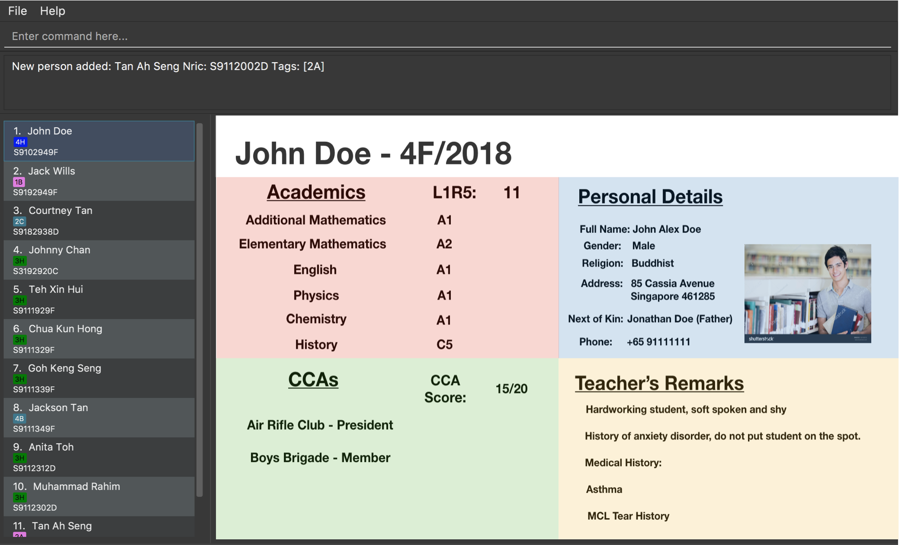

= EduBuddy

ifdef::env-github,env-browser[:relfileprefix: docs/]

https://travis-ci.org/CS2103JAN2018-T09-B1/main[image:https://travis-ci.org/CS2103JAN2018-T09-B1/main.svg?branch=master[Build Status]]
https://ci.appveyor.com/project/kengsengg/main[image:https://ci.appveyor.com/api/projects/status/imspkq3b5pvh5p1d?svg=true[Build status]]
https://coveralls.io/github/CS2103JAN2018-T09-B1/main?branch=master[image:https://coveralls.io/repos/github/CS2103JAN2018-T09-B1/main/badge.svg?branch=master[Coverage Status]]
https://www.codacy.com/app/kengsengg/main?utm_source=github.com&amp;utm_medium=referral&amp;utm_content=CS2103JAN2018-T09-B1/main&amp;utm_campaign=Badge_Grade[image:https://api.codacy.com/project/badge/Grade/aa9351de0bd0451596b55bf5839464d9[Codacy Badge]]

ifdef::env-github[]

endif::[]

ifndef::env-github[]

endif::[]

* This is a desktop student profiling application. It has a GUI but most of the user interactions happen using a CLI (Command Line Interface).
* It is a Java sample application intended for secondary school teachers while using Java as the main programming language.

== Site Map

* <<UserGuide#, User Guide>>
* <<DeveloperGuide#, Developer Guide>>
* <<AboutUs#, About Us>>
* <<ContactUs#, Contact Us>>

== Acknowledgements

* The source code for this application is adapted from https://github.com/se-edu/addressbook-level4[AddressBook-Level 4 Project] created by SE-EDU initiative.
* Some parts of this sample application were inspired by the excellent http://code.makery.ch/library/javafx-8-tutorial/[Java FX tutorial] by
_Marco Jakob_.
* Libraries used: https://github.com/TomasMikula/EasyBind[EasyBind], https://github.com/TestFX/TestFX[TextFX], https://bitbucket.org/controlsfx/controlsfx/[ControlsFX], https://github.com/FasterXML/jackson[Jackson], https://github.com/google/guava[Guava], https://github.com/junit-team/junit4[JUnit4]

== Licence : link:LICENSE[MIT]
