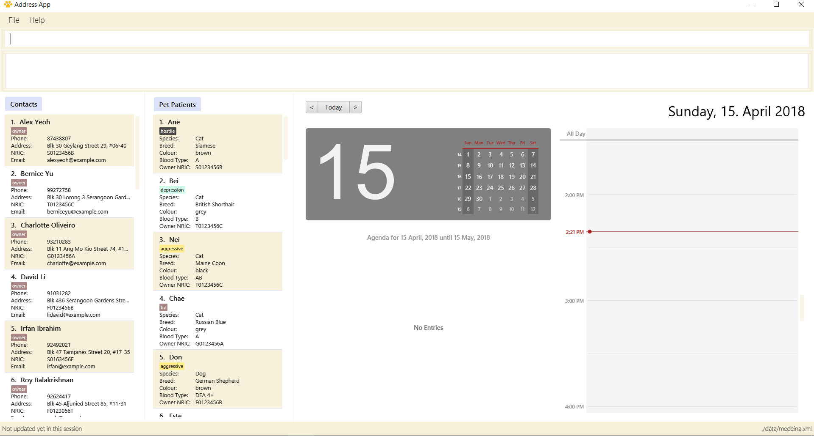

= Delivery
ifdef::env-github,env-browser[:relfileprefix: docs/]

https://travis-ci.org/CS2103JAN2018-F11-B4/main[image:https://travis-ci.org/CS2103JAN2018-F11-B4/main.svg?branch=master[Build Status]]

ifdef::env-github[]

endif::[]

ifndef::env-github[]
image::images/Ui.png[width="600"]
endif::[]

* This is a desktop Food Ordering application. It has a GUI but most of the user interactions happen using a CLI (Command Line Interface). It is designed to be user-friendly and easy-to-master.
* It is a Java application targeted for small-medium restaurants who wish to have an independent food-ordering and delivery-managing system.
* It is written in OOP fashion. The code base is reasonably well-written and is significantly big (around 6 KLoC)
* Contains support for Build Automation using Gradle and for Continuous Integration using Travis CI.

== Site Map

* <<UserGuide#, User Guide>>
* <<DeveloperGuide#, Developer Guide>>
* <<AboutUs#, About Us>>
* <<ContactUs#, Contact Us>>

== Acknowledgements

* Some parts of this sample application were inspired by the excellent http://code.makery.ch/library/javafx-8-tutorial/[Java FX tutorial] by
_Marco Jakob_.
* Libraries used: https://github.com/TomasMikula/EasyBind[EasyBind], https://github.com/TestFX/TestFX[TextFX], https://bitbucket.org/controlsfx/controlsfx/[ControlsFX], https://github.com/FasterXML/jackson[Jackson], https://github.com/google/guava[Guava], https://github.com/junit-team/junit4[JUnit4]

== Licence : link:LICENSE[MIT]
